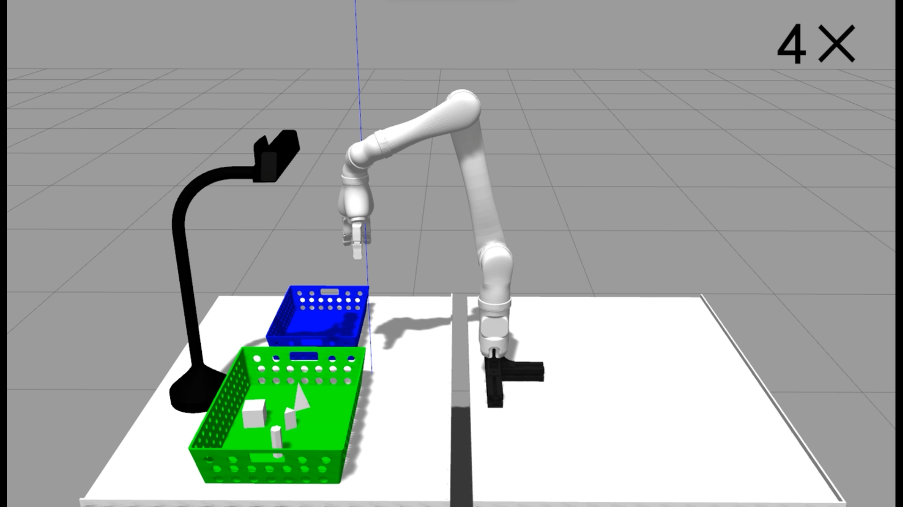
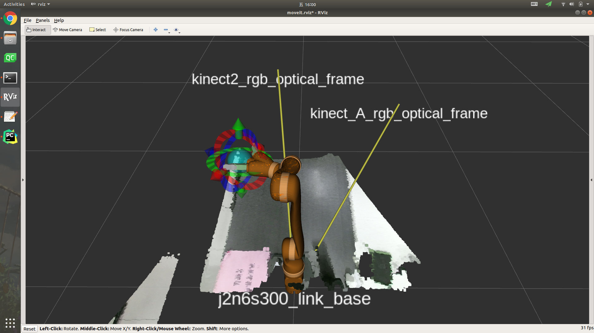
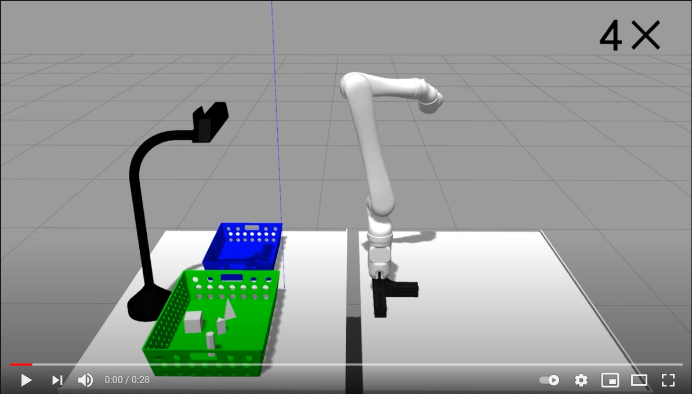

# Upper-level-task-planning-of-Jaco-based-on-behavior-tree
Use behavior tree and DMP for upper-level task planning.

## Table of Contents

- [Background](#background)
- [Install](#install)
  - [Environment](#environment)
  - [Step1](#step1)  
  - [Step2](#Step2) 
  - [Step3](#step3)  
- [Usage](#usage)
- [Result](#result)
- [Contributing](#contributing)


## Background

This repository is a Kinova Jaco2 robot arm upper-level task planning **Simulation Environment** based on DMP and behavior tree.

## Install

This project was developed based on ROS Melodic under Ubuntu 18.04, and the simulation environment was improved based on [@freeman-1995](https://github.com/freeman-1995) project [JCAR-Competition](https://github.com/freeman-1995/JCAR-Competition).
Based on his project, the Kinova Jaco v3 robot arm model was replaced with the Kinova Jaco v2 model.



### Environment

This Package is tested on ubuntu18.04, ros melodic with GPU RTX 2060.

### Step1

System environment : source code installation pointcloud library [pcl](https://github.com/PointCloudLibrary/pcl) with version1.8.1,[vtk](https://github.com/Kitware/VTK) with version7.1.1
and [opencv](https://github.com/opencv/opencv) with version 4.1.2.

> You need to add GPU options when compiling the above three packages.

### Step2

The package [find-object](https://github.com/introlab/find-object) is used for object recognition.

### Step3

Use the [behavior tree](https://github.com/miccol/ROS-Behavior-Tree) framework to plan the tasks of the segmented dynamic motion primitives.

## Usage

Compile the package

0. Clone the repository.

```sh
git clone https://github.com/Lygggggg/Upper-level-task-planning-of-Jaco-based-on-behavior-tree
cd Upper-level-task-planning-of-Jaco-based-on-behavior-tree
```

1. Go to the package named JCAR-Competition-master/robot_grasp, find the CmakeLists file inside. Comment out all the add_execytable and target_link.

2. catkin_make the workingspace.

```sh
cd Upper-level-task-planning-of-Jaco-based-on-behavior-tree
catkin_make
```

3. recover the items that are commented out before.

4. catkin_make the workingspace angin.

```sh
catkin_make
```

Run

1. Start the Gazebo simulation environment.
```sh
roslaunch robot_grasp START_Gazebo.launch
```

2. Start Rviz.
```sh
roslaunch robot_grasp START_Moveit.launch
```


3. Load the object to be grabbed into the Gazebo simulation environment.
```sh
$ roslaunch robot_grasp load_aruco_object.launch/loadall_object_part1.launch
# load_aruco_object.launch : Indicates that the QR code box is loaded;
# loadall_object_part1.launch : Indicates that some objects are loaded.
```

4. Start the find-object function package for object recognition, and select the object to obtain the position of the object.
```sh
roslaunch find_object_2d find_object_3d_simu.launch
```

5. Send the position of the identified object to the Ros parameter server.
```sh
rosrun robot_grasp find_and_pub
```

6. Start the behavior tree for object pick and place.
```sh
roslaunch behavior_tree_leaves pick_place_tree.launch
# or
roslaunch behavior_tree_leaves new_tree_like_guyue.launch
```

## Result

Simulation experiment video.

[](https://www.youtube.com/watch?v=Scji1yu_w7I)

## Contributor

This project exists thanks to all the people who contribute. 
